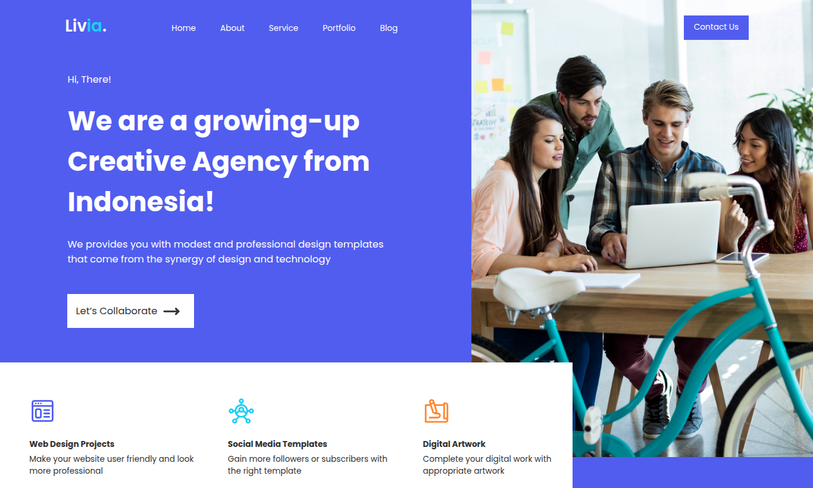

# 🎨 Livia – Creative Agency Landing Page
Landing page desarrollada con **HTML5** y **CSS3** a partir de un diseño en Figma.

## 🖼️ Vista Previa
A continuación se muestra una vista previa de la landing page desarrollada a partir del diseño en Figma.

## 📘 Descripción General

Livia es una landing page desarrollada con **HTML5** y **CSS3**, tomando como referencia un diseño realizado en **Figma.**

El proyecto se enfoca en transformar una propuesta visual en una interfaz web funcional, aplicando técnicas de maquetación y estilos para reproducir la estructura, distribución y apariencia del diseño original.

## 🎯 Objetivo del Proyecto

El objetivo de este proyecto es fortalecer mis conocimientos en **HTML5** y **CSS3** mediante la creación de una landing page a partir de un diseño en Figma.

Durante su desarrollo busqué mejorar mis habilidades para estructurar contenido, organizar elementos visuales y aplicar estilos de manera ordenada, procurando reproducir fielmente el diseño de referencia y convertirlo en una interfaz web funcional.

## ✨ Características Principales

* **🎨 Diseño basado en Figma:** desarrollo de la interfaz tomando como referencia el diseño original.
* **🧱 Estructura semántica:** organización del contenido mediante elementos HTML5.
* **🎯 Estilización con CSS3:** aplicación de tipografías, colores, tamaños, espaciados y distribución de los elementos.
* **🖼️ Integración de recursos visuales:** incorporación y posicionamiento de imágenes y elementos gráficos del diseño.
* **🖥️ Reproducción visual del diseño:** adaptación de la propuesta gráfica de Figma a una interfaz web funcional.

## 🧩 Estructura del Proyecto

Landing_Livia/
├── css/
├── images/
└── index.html

**index.html** — Contiene la estructura y el contenido de la landing page.
**css/** — Contiene los archivos CSS utilizados para definir los estilos y la apariencia de la página.
**images/** — Contiene los recursos gráficos utilizados en el proyecto.

## 🧠 Conceptos Aplicados

* **HTML5 semántico:** organización del contenido mediante una estructura clara y elementos HTML apropiados.
* **Estructura y jerarquía del contenido:** distribución de títulos, textos, imágenes y elementos de navegación.
* **Selectores CSS:** aplicación de estilos mediante selectores de elementos, clases y otros selectores utilizados en el proyecto.
* **Modelo de caja (Box Model):** manejo de márgenes, rellenos, bordes y dimensiones de los elementos.
* **Flexbox:** organización y alineación de elementos dentro de diferentes secciones de la página.
* **Tipografía y colores:** aplicación de fuentes, tamaños, pesos y colores para reproducir la identidad visual del diseño.
* **Variables CSS:** definición y reutilización de valores de diseño para mantener consistencia en los estilos.
* **Unidades relativas:** utilización de unidades como vw para establecer dimensiones y tamaños de algunos elementos.

## 🎨 Tecnologías Utilizadas

* **HTML5** — Estructuración y organización del contenido de la landing page.
* **CSS3** — Diseño, estilos, distribución y presentación visual de la interfaz.
* **Figma** — Herramienta utilizada como referencia para el diseño de la landing page.
* **Visual Studio Code** — Entorno utilizado para el desarrollo del proyecto.
* **Git & GitHub** — Control de versiones y almacenamiento del proyecto.
